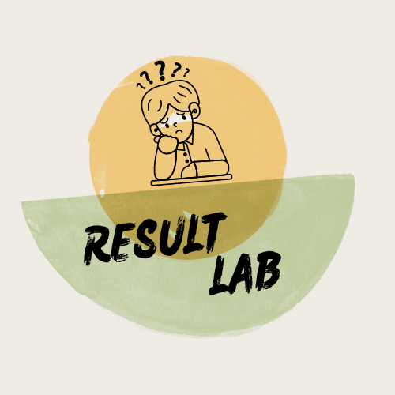

# 🎓 Student Result Management System

<p align="center">
  <b>A modern desktop-based Student Result Management System built with Python, Tkinter and SQLite.</b>
</p>

<p align="center">
  
</p>

---

## 📌 About The Project

**Student Result Management System** is a Python-based desktop application designed to simplify student, course, examination and result management.

The application provides an interactive dashboard where administrators can manage academic records and view student results through a centralized SQLite database.

This project was developed as a practical learning project to strengthen skills in:

- Python
- Tkinter GUI Development
- SQLite Database Management
- CRUD Operations
- Desktop Application Development
- Git & GitHub

---

## 🚀 Features

### 📊 Dashboard
- Modern Admin Dashboard
- Live student statistics
- Course statistics
- Examination records
- Result records
- Recent student records

### 👨‍🎓 Student Management
- Add student information
- Manage student records
- Store contact and academic details
- View student information

### 📚 Course Management
- Add courses
- Course duration
- Course charges
- Course descriptions
- Course reports

### 📝 Examination Management
- Create examination records
- Store subject-wise marks
- Track examination details

### 📈 Result Management
- Add student marks
- Calculate results
- Generate student reports
- Generate course reports

### 🗄️ Database Viewer
- View SQLite database tables
- Search database records
- Refresh database data
- Inspect stored student and result information

### 🤖 AI Assistant Interface
- AI Assistant interface included in the dashboard
- Designed for future AI integration
- Can later be connected with an AI API/backend

---

## 🛠️ Technologies Used

| Technology | Purpose |
|---|---|
| 🐍 Python | Application development |
| 🖥️ Tkinter | Graphical User Interface |
| 🗄️ SQLite | Database |
| 🖼️ Pillow | Image processing |
| 📊 Matplotlib | Reports / data visualization |
| 🔧 Git | Version control |
| 🌐 GitHub | Project hosting |

---

## 📂 Project Structure

```text
Student-Result-Management-System/
│
├── dashboard.py
├── student.py
├── course_details.py
├── exam_record.py
├── result.py
├── final_report.py
├── course_report.py
├── database_viewer.py
├── create_db.py
├── add_demo_data.py
│
├── student_result_management.db
├── student_result_management_backup.db
│
├── logo.png
├── chatbot.png
│
├── demo/
│   ├── 1.png
│   ├── 2.png
│   ├── 3.png
│   ├── 4.png
│   ├── 5.png
│   ├── 6.png
│   └── 7.png
│
└── .gitignore
```

---

## ▶️ How To Run

### 1️⃣ Clone the repository

```bash
git clone https://github.com/DevRahul17/Student-Result-Management-System.git
```

### 2️⃣ Open the project

```bash
cd Student-Result-Management-System
```

### 3️⃣ Install required packages

```bash
pip install pillow matplotlib
```

### 4️⃣ Run the application

```bash
python dashboard.py
```

---

## 💻 Application

The application includes a centralized dashboard for managing:

```text
Students
   ↓
Courses
   ↓
Examinations
   ↓
Marks
   ↓
Results
   ↓
Reports
```

---

## 📸 Screenshots

Screenshots and demo images are available in the [`demo`](demo/) folder.

---

## 🔮 Future Improvements

Planned improvements include:

- 🤖 Real AI-powered assistant
- 🌐 Web-based version
- 🔐 Admin authentication
- 📱 Responsive interface
- ☁️ Cloud database support
- 📊 Advanced analytics
- 📤 Export reports to PDF/Excel
- 🔔 Notification system
- 👥 Multiple user roles

---

## 👨‍💻 Author

### Rahul Kumar

**GitHub:**  
https://github.com/DevRahul17

**Project:**  
Student Result Management System

---

## ⭐ Support

If you find this project useful, consider giving the repository a ⭐ on GitHub.

---

## 📄 License

This project is created for educational and learning purposes.